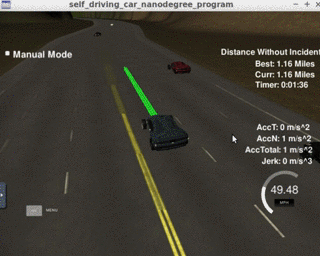

# CarND-Path-Planning-Project
Self-Driving Car Engineer Nanodegree Program
   
### Goals
The goal of this project is to design a path planner that is able to create smooth, safe paths for the car to follow along a 3 lane highway with traffic.

The solution consists of the following files:

1. main.cpp: interfaces with the simulator and invokes the path planner.
2. planner.hpp: implements the path planner. Given the telemetry data provided from the simulator generates a new path for the car in world coordinates.
3. spline.h: cubic spline interpolation library by Tino Kluge used by the trajectory generator.
4. json.hpp: JSON library for C++ used to interface the simulator.

All components of the path planner are included in the main.cpp.

#### The map of the highway is in data/highway_map.txt
Each waypoint in the list contains  [x,y,s,dx,dy] values. x and y are the waypoint's map coordinate position, the s value is the distance along the road to get to that waypoint in meters, the dx and dy values define the unit normal vector pointing outward of the highway loop.

The highway's waypoints loop around so the frenet s value, distance along the road, goes from 0 to 6945.554.

The planner itself proceeds in five steps:
1. Trajectory generation: This basically is responsible to generate a path which the vehicle needs to follow.
2. Sensor fusion: Here, we use the provided sensor fusion to gather information about the other vehicles such as their speed and the lane they are driving on.
3. Speed control and collision avoidance: Acceleration and deceleration are defined to avoid violations and jerks to enable speed adjustments.
4. Lane switching and cruising: Conditions defined under which to switch lanes or keep driving at the current lane.
5. Behavior planning (especially lane choosing): strategies for setting a future lane to drive in. Cost functions are the key factor here. Low Cost, low traffic and highest average speed are the options available.

## Trajectory generation
Trajectory generation is a low level action which gets the car to move according to the lane lines. Conditions are defined to avoid driving outside of lanes or directly on the lane lines, bearing in mind the smooth steering. The code for generating trajectories is based on the spline library and is mostly adopted from the Project Q&A video with some minor changes. The code corresponding to trajectory generation can be found from approx. line 323 - 427 in main.cpp.

## Sensor fusion
We use sensor fusion to obtain information about the other vehicles on the road, such as their speed, their lanes and their distance to our vehicle. These type of information will be used in all the other components, such as speed control and lane selection.

## Speed control and collision avoidance
The speed of the leading vehicle is used over the sensor fusion vector in Frenet coordinates. On noticing the lead car position (s) within a certain safety distance, a decision check is made on whether a lane change is permissible or not. When its not possible, the vehicle is made to decelerate to match the velocity of the leading vehicle through a pre-defined deceleration rate. When the lane is clear again (upon say, lane changing) the vehicle is accelerated to the target speed.
A collision warning is established within 15m distance. A so called "EMERGENCY BRAKING" is enabled with a higher deceleration avoiding the violation limit.

(include gif here)

## Lane change maneuver
Lane change involves using sensor fusion information, primarily to determine the distance of other vehicles. The major distingishing factors are whether a lead vehicle is being followed, or driving on a lane with no traffic ahead.
If a vehicle is on the same lane as us and the distance falls below a certain safety distance (this could be done as function of speed dependancy), we check if a lane change is possible by measuring the distance of the vehicles on the adjacent lane(s). If, on the adjacent lane(s), no vehicle is within 30m in front or behind us, we perform the lane change. If a lane change is not possible due to other vehicles being present within the safety distance, we tell the vehicle to keep the current lane and to eventually slow down if needed.

## Behaviour Planning
Two main tactical planning strategies are implemented in this project, where the strategies are switched approximately halfway across the track.

"Keeping to the right as much as possible" is a highway traffic regulation, implemented in many european countries. Hence, to fulfill this legal requirement, it is always attempted to keep the vehicle to the right-most lane.



This animation illustrates this strategy.

"Choose lane with the highest average speed" (in addition, strategies such as lane with the lowest cost | lane with least vehicles are also mentioned, but commented) is preformed in the second half of the track. The pre-defined cost function determines the weighted sum of 1) switching lanes and driving below a certain speed limit.

Since we are dealing with only three distinct lanes, we have only three discrete values which could be considered for determining the cost. This also ensures that no unnecessary lane changes occur.

```
lane_switch_cost = delta_lane * (1-exp(-delta_lane))
```
where `delta_lane = abs(current_lane - other_lane)`

The speed limit penalty is factorised higher to ensure a smooth driving in traffic. The speed cost is computed as:
```
speed_cost = abs(speed_lim - speed_lane)/speed_lim
```
where the `speed_lane` is the average speed on a certain lane, calculated across the average vehicle speed within 80m ahead of the vehicle. Average speeds of each lane is established through the information received by sensor fusion. If a lane has no traffic, the vehicle is then able to drive at the set speed limit.

This driving strategy replicates a driving strategy to optimise time. The cost functions tries and limits the "aggressiveness" of the vehicle by avoiding frequent lane changes.

### Summary
Repetitive testing illustrates that the path planning algorithm is operational. An attempt was made to integrate a smart telemetry, usind data from the sensor fusion and actually highlight the data, used for the decision making (e.g. Lane Status, average speeds per lane, details of every vehicle in the forecasted distance for behavioural planning). However, this leads to a lag between the program execution and the simulation, resulting in jerk and acceleration value violations.

Further adaptive driving optimisation is easily possible. However, I am pressed for time to finish the course by the end of the month. Hence, it would be prioritized for a later date.

## Basic Build Instructions

1. Clone this repo.
2. Make a build directory: `mkdir build && cd build`
3. Compile: `cmake .. && make`
4. Run it: `./path_planning`.

Here is the data provided from the Simulator to the C++ Program

#### Main car's localization Data (No Noise)

["x"] The car's x position in map coordinates

["y"] The car's y position in map coordinates

["s"] The car's s position in frenet coordinates

["d"] The car's d position in frenet coordinates

["yaw"] The car's yaw angle in the map

["speed"] The car's speed in MPH

#### Previous path data given to the Planner

//Note: Return the previous list but with processed points removed, can be a nice tool to show how far along
the path has processed since last time. 

["previous_path_x"] The previous list of x points previously given to the simulator

["previous_path_y"] The previous list of y points previously given to the simulator

#### Previous path's end s and d values 

["end_path_s"] The previous list's last point's frenet s value

["end_path_d"] The previous list's last point's frenet d value

#### Sensor Fusion Data, a list of all other car's attributes on the same side of the road. (No Noise)

["sensor_fusion"] A 2d vector of cars and then that car's [car's unique ID, car's x position in map coordinates, car's y position in map coordinates, car's x velocity in m/s, car's y velocity in m/s, car's s position in frenet coordinates, car's d position in frenet coordinates. 
